# Assignment I : Integration of CI/CD on To-Do App Deployment

## Step 0: Creating the Todo List Application
 - Created full functional to-do list app with 
    - Frontend: User interface for implementation of CRUD functions.
    - Backend: CRUD API to handle task operations.
    - Database: PostgreSQL database to store data or tasks.

## Part A: Deploying a Pre-Built Docker Image to Docker Hub

Steps Taken:
1. Build and Push Docker Images
Created Dockerfiles for both backend and frontend 

Backend(be-todo)

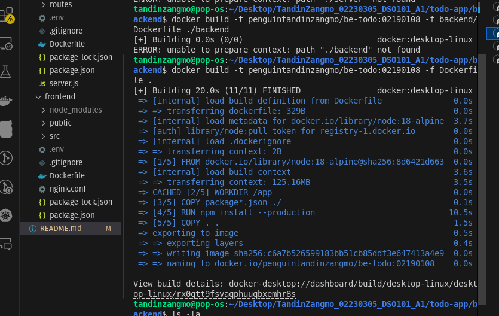

Frontend(fe-todo)

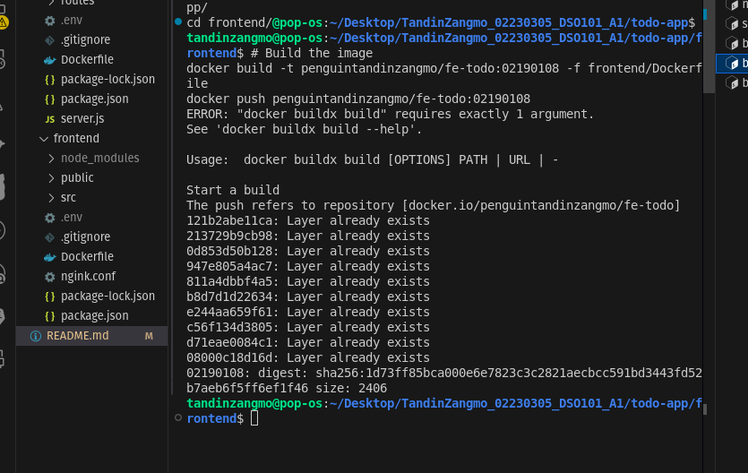

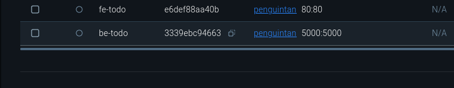

2. Deploying on Render

Deployed both backend and frontend as a Web Service from existing Docker image.

Backend
 
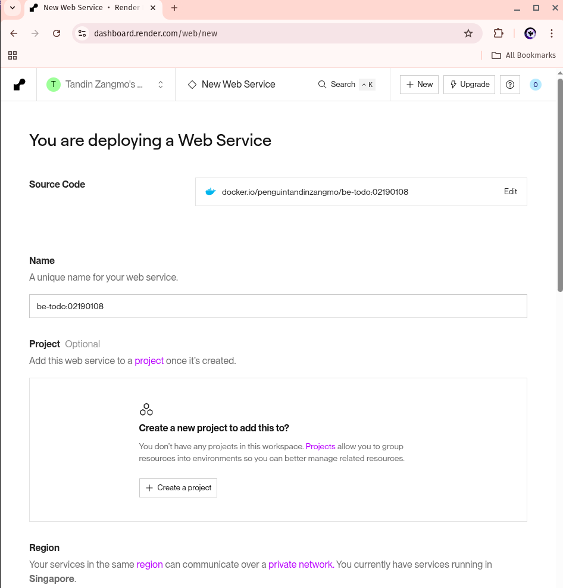

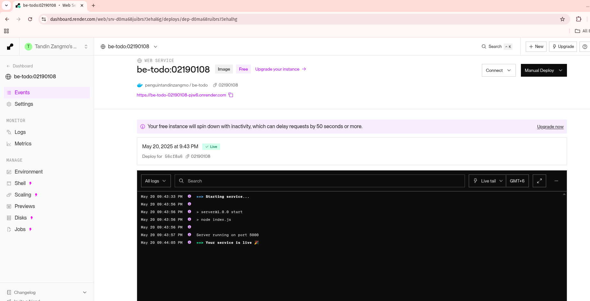

Frontend

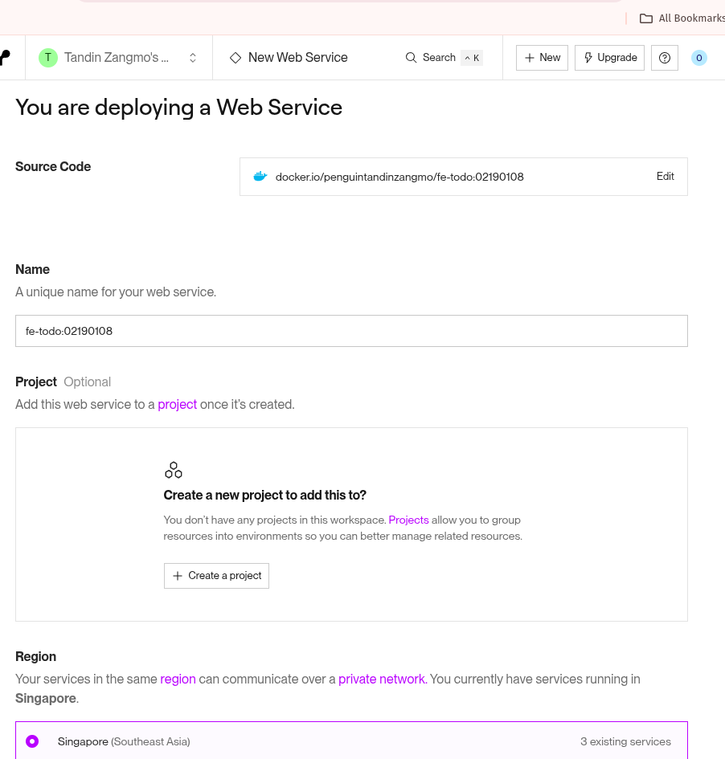

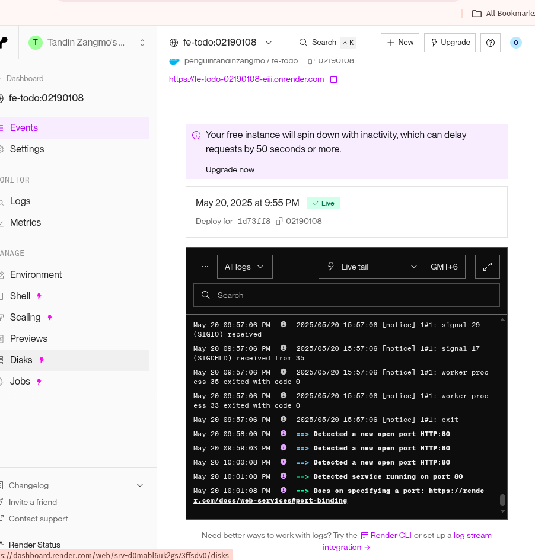

### Conclusion

Successfully built a todo application with react, node.js and postgreSQL. Learned how to use docker for packaging applications. Using Render to deploy and manage services.

# Assignment II: CI/CD Pipeline with Jenkins

Implementation of of a jenkins CI/CD pipeline for build, test and deployment process of node.js from assignment 1.

1. Jenkins Setup

Installed Jenkins and ran on localhost:8080

Installed required plugins:

NodeJS Plugin (for npm)
Pipeline
GitHub Integration
Docker Pipeline

2. NodeJS Configuration in Jenkins
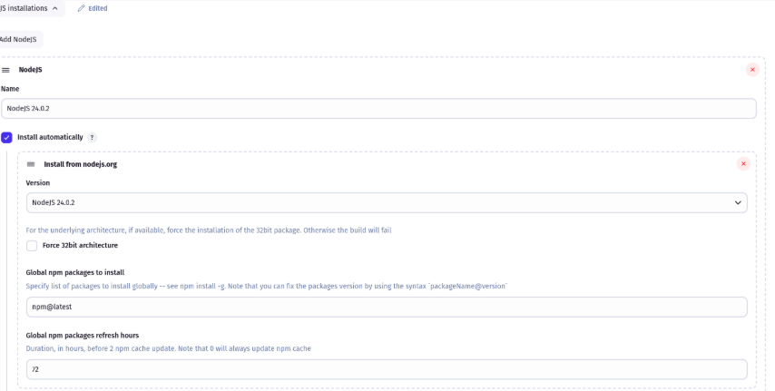

3. GitHub Repository Integration
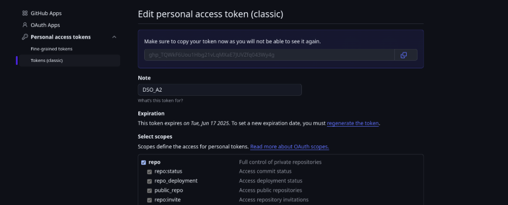
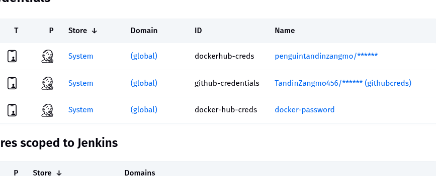

4. Jenkinsfile Implementation
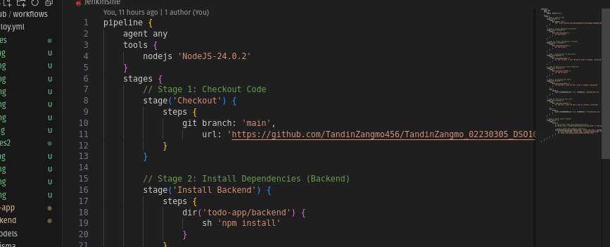

5. Pipeline Execution
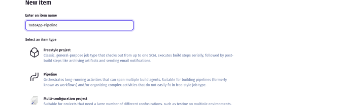

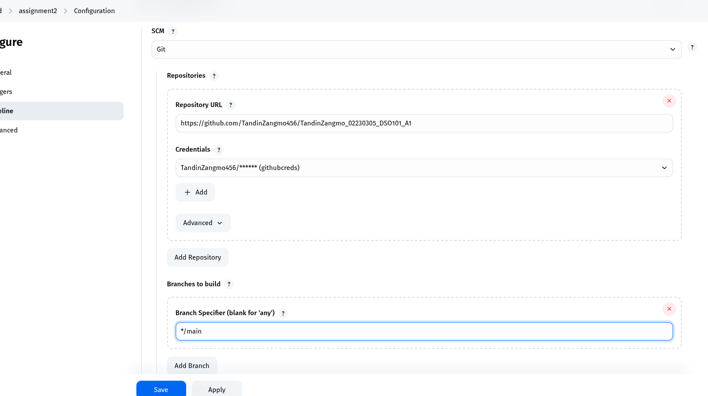

Successful pipeline execution
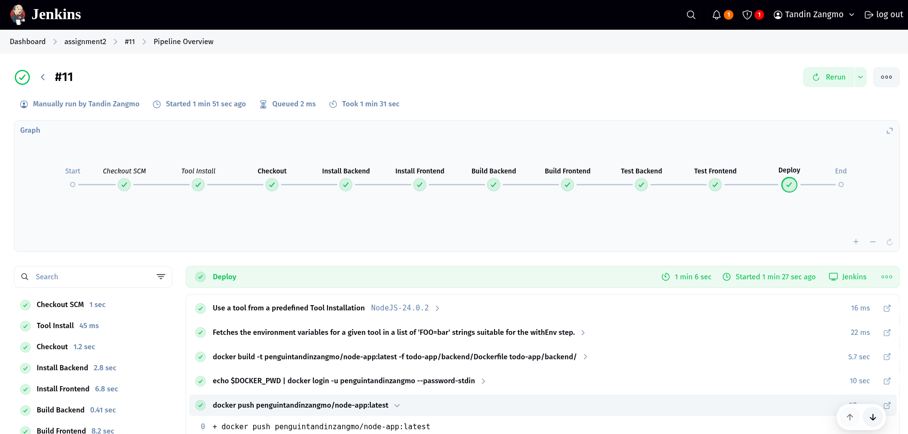

DockerHub image
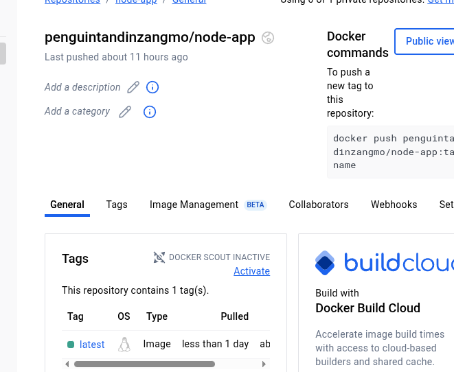

Image link 
https://hub.docker.com/repository/docker/penguintandinzangmo/node-app/tags/latest/sha256-aa7ed39d4841ef95c4515ba7d5b412b4b0dfab5192a8ee1d30304cfae58fabdd

# Assignment III : CI/CD with GitHub Actions

## GitHub Actions Pipeline Implementation

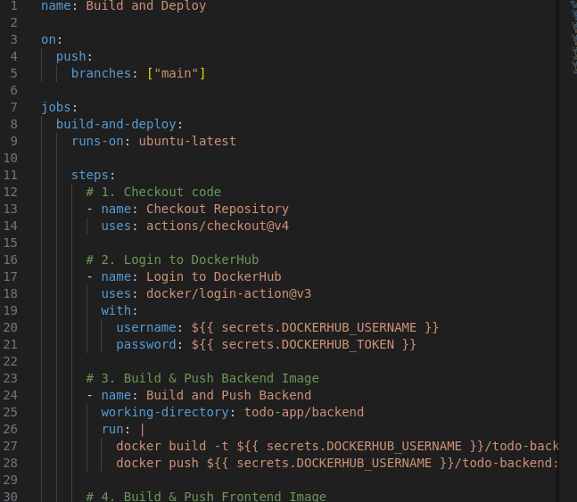

## GitHub Secrets Configuration
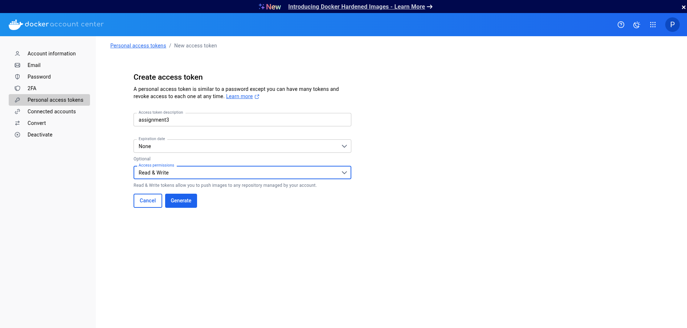

## Pipeline Testing and Validation
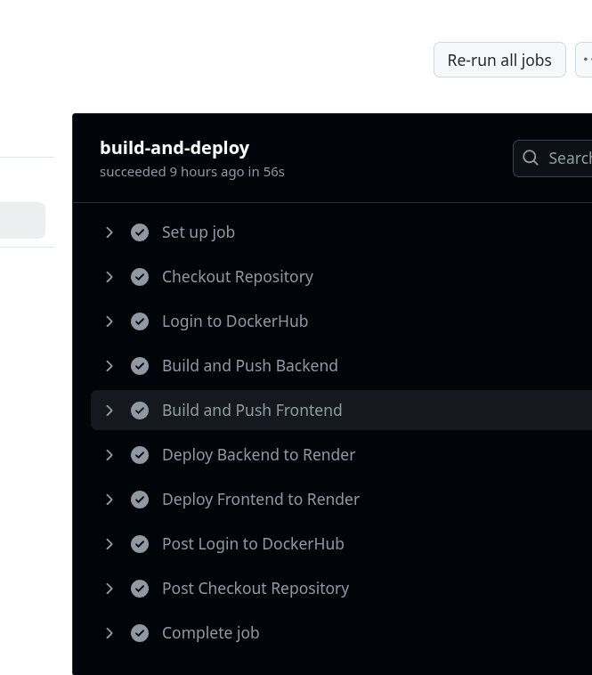

## Deployment Verification
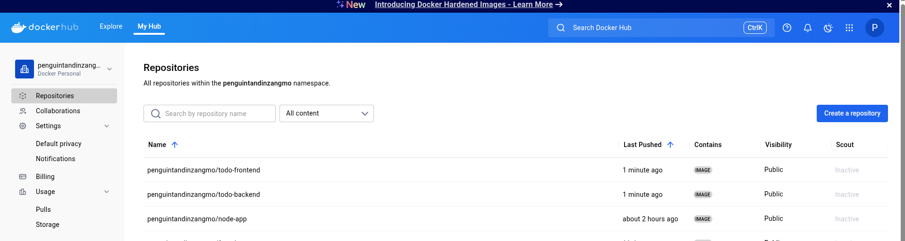

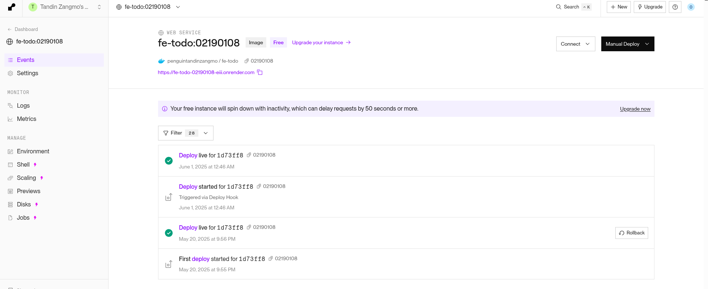